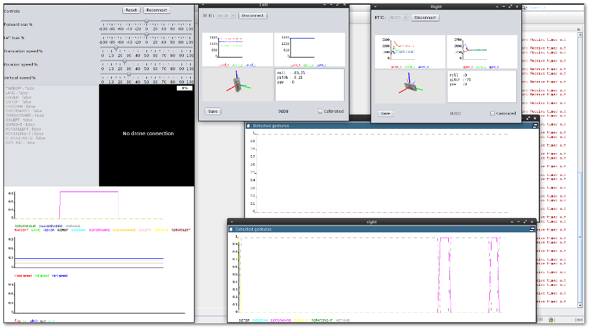
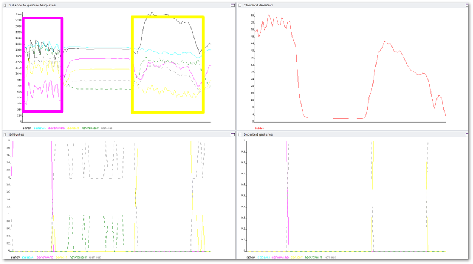

=======================
ARDrone Gesture Control
=======================
A Java library to control a Parrot ARDrone_ using Shimmer_ accelerometer sensor placed on the wrists.
The library should be flexible enough so it can be adapted to other sensor types or such that only the ARDrone control part can be used.

To get the latest binary version, check out the releases :

https://github.com/heig-iict-ida/ardrone_gesture/releases

This software was developped at the `HEIG-VD <http://www.heig-vd.ch>`_ and presented (and tried by children)
during the opening day of the "Souvenirs du Futur" exhibition at `La Maison d'Ailleurs <http://www.ailleurs.ch>`_

ARDrone control
---------------
The ARDrone control part is implemented in `Project_Quadropter`. Most of the
interesting stuff is in the madsdf.ardrone package. This has been tested on
version 1 of the ARDrone.

Gesture recognition
-------------------
Gesture recognition works by comparing (windowed) incoming accelerometer data
with a set of gesture templates. When the distance between the current data
and a template is below a threshold, we recognize the gesture.

More precisely, we use a `K-nearest neighbors` classifier with `k=3` to classify
gesture. We also impose a threshold on the standard deviation of the window
to avoid gesture recognition when the user is at rest.

For more information on gesture recognition, see docs/gesture_recognition.rst.

Video of the movements are available on youtube :

https://www.youtube.com/playlist?list=PLlPxCK3f6RNzy-o8ZU_1FBO7phrK6cJzv

Online gesture detection
........................
Online gesture detection is performed in `Projet_Quadropter`. A window as shown
below is displayed for each Shimmer. It shows the distance to gesture templates,
the votes of the closest neighbors, the standard deviation for the current window
and the detected gesture (if any).

Project Setup Notes
===================
This project requires that you add ShimmerMoveAnalyzer_ as a dependency (in
netbeans, go to libraries/compile -> Add Project).

Also, you need to add all jars in ShimmerMoveAnalyzer/lib/jogl/ to your
runtime classpath (go to libraries/run -> Add JAR/Folder and add all the jars
in jogl)

Creating an archive for binary distribution
-------------------------------------------
You can use the generate_dist_zip.sh script, which does the following
1. Compile ARDroneController
2. Copy the jar in shimmer_move_analyzer/dist/lib to ardrone_gesture/dist/lib
3. Copy ardrone_gesture/data to ardrone_gesture/dist/data
4. Create a zip of ardrone_gesture/dist and distribute

Windows
-------
If the program fails to start with a bluecove-related issue, you can try
to add the bluecove jar as a run dependencie (project properties -> libraries,
run tab)

Linux
-----
On Ubuntu, you need libbluetooth-dev . On other distributions, the package
providing libbluetooth.so .

Credits
.......
Copyright 2013 HEIG-VD

Written by Grégoire Aubert and Julien Rebetez

With advices from Andres Perez-Uribe and Héctor Satizábal

.. _ARDrone: http://ardrone2.parrot.com/
.. _Shimmer: http://www.shimmer-research.com/
.. _ShimmerMoveAnalyzer: https://github.com/heig-iict-ida/shimmer_move_analyzer

License
.......
This program is free software: you can redistribute it and/or modify
it under the terms of the GNU General Public License as published by
the Free Software Foundation, either version 3 of the License, or
(at your option) any later version.

This program is distributed in the hope that it will be useful,
but WITHOUT ANY WARRANTY; without even the implied warranty of
MERCHANTABILITY or FITNESS FOR A PARTICULAR PURPOSE.  See the
GNU General Public License for more details.

You should have received a copy of the GNU General Public License
along with this program.  If not, see <http://www.gnu.org/licenses/>.
