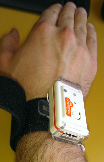
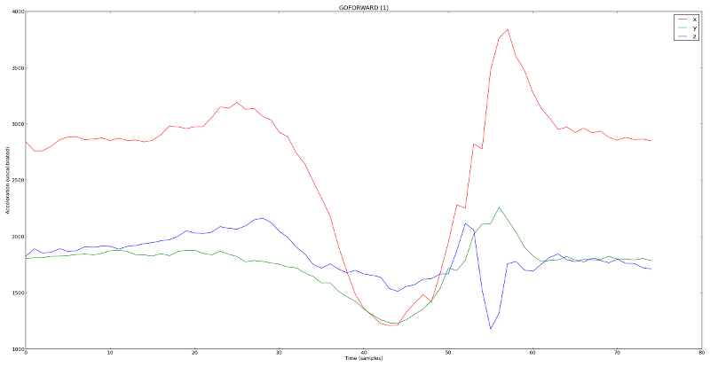
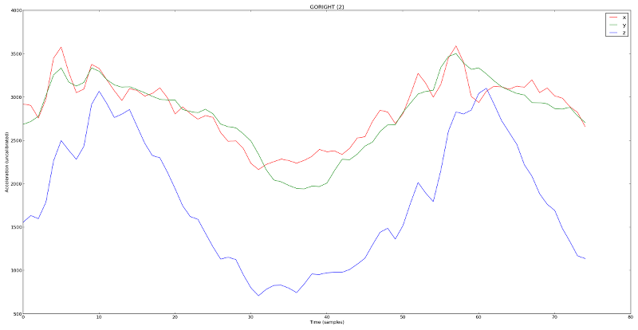
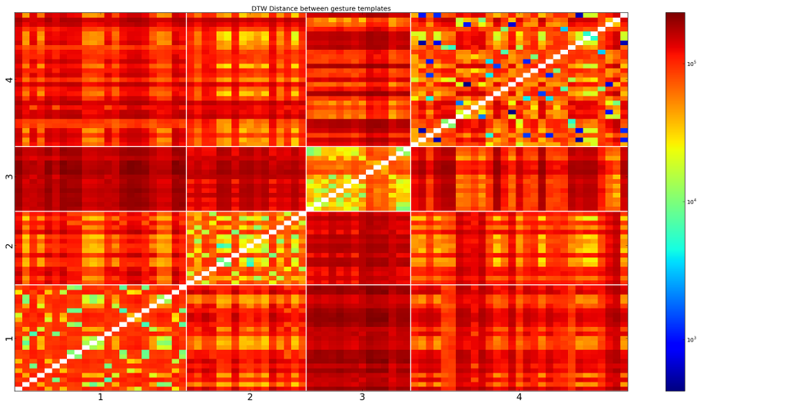
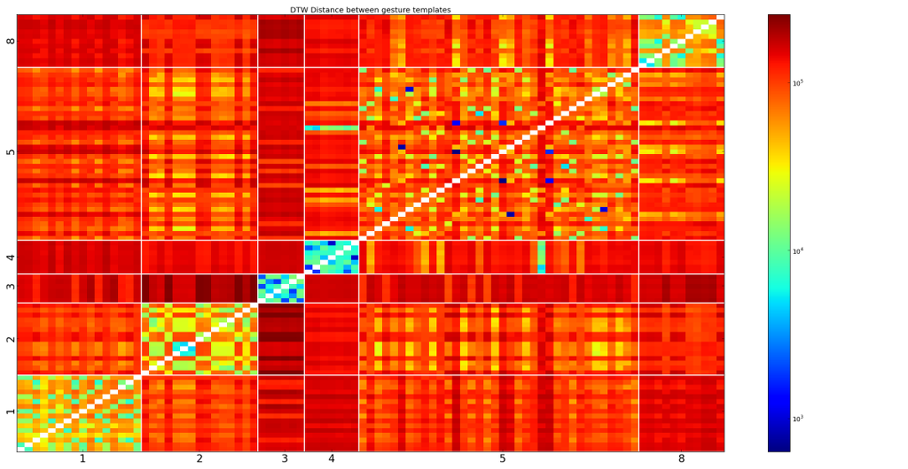

Overview of Gesture Recognition
===============================
This is a quick overview of gesture recognition using accelerometer as implemented
for our ARDrone Gesture Control project.

We use 3-axis Shimmer accelerometers, placed on the wrists of the subject as
shown in the following image :

The face of a gesture
---------------------
To give you an idea of what kind of data we're working with, let's look at the
plots of two different gesture : "Go Forward" and "Go Right", both executed
with the right hand.

Go Forward
..........

Go Right
........

Gesture recognition using KNN
-----------------------------
To recognize gesture, we use a database of gesture templates (with multiple
templates for each gesture we want to recognize) and compute the distance
between incoming accelerometer data and each of the templates. We then look
at the labels for the 3 closest templates. If at least 2 labels are the same,
we can say we recognize the gesture. Otherwise, we don't know what the gesture
is. What we just described is called the `K-nearest neighbors` and in our case,
we use `k=3`.

For example, look at the following image :

.. image:: images/detection_window_highlighted_small.png

In the top left plot, we have the distance of the incoming data to each group
of templates. In black is the (minimum) distance to all templates corresponding
to GOTOP. In pink, the minimum distance to all templates corresponding to GOFORWARD.
During the part highlighted in pink, I was performing the GOFORWARD command
and as you can see, the pink line is well below all the others. Similarly,
during the part highlighted in yellow , I was performing the GORIGHT command
and again, the yellow line goes down.

In the bottom left plot, the "votes" from the 3 closest neighbors are shown. If
all neighbors agree on the same gesture, it will have a score of 3. That's the
case for when I'm performing GOFORWARD and GORIGHT as you can see. In-between,
it's a little bit more messy, with the system matching NOTHING (a group of
templates with movements we *don't* want to recognize) and ROTATERIGHT. In this
case, it's NOTHING that should be matched as I wasn't doing anything interesting.
So that's why we use 3 neighbors : it allows us to be more robust. We could use
even increase the number of neighbors we use, but this would require more
templates.

In the top right plot, the standard deviation averaged over all 3 axis is shown.
This is used to increase the robustness of our system. We are trying to recognize
movements and during a movement, the standard deviation will increase since we'll
have quickly varying accelerometer reading. On the contrary, when we are at rest
or moving slowly, the standard deviation will be small. So we use a simple threshold
on the standard deviation to disable gesture recognition when it's too small. It's
a bit of a hack, but it helps make the system more robust to random movements.

Finally, in the bottom right plot, you see the gesture actually detected by
the system. As you can see, GOFORWARD is correctly detected and GORIGHT too, with
NOTHING in-between.

Measuring distance between gestures
-----------------------------------
We know how we are going to recognize gestures once we have a distance between
the incoming data and the templates in our database. What we'll explore now
is how we compute this distance.

Windowing
.........
We receive our data one sample at a time, but we can't really do anything with
just 3 values (one for each axis). So we are going to accumulate the data
into `windows`. A window is simply a time series of data with a given length.
In our case, we use windows of 75 samples. Since we receive data at 30hz, that's
about 2.5 seconds. So we will do all our computation using the last 2.5 seconds
of movement. This also mean our gesture templates should have the same size as
our window and therefore we use templates of size 75 as well.

Euclidean distance
..................
Once we have windows, we can compute the distance between two windows. We will
want to compute the distance between a window of incoming data and one template.
To do that, the easiest solution is to use (squared) euclidean distance.
That is, simply consider each axis as a vector with 75 elements and compute
the euclidean distance between the incoming data x axis and the template x axis.
Then, by suming this distance over all 3 axis, we get a distance metric.

Dynamic time warping
....................
Euclidean distance can work well, but it is very sensitive to slight variations
in time or speed of the movement execution. For example, if the two windows contain
the same values, but shifted by 10 samples, the euclidean distance will be high.
Dynamic time warping is an algorithm that is more robust to those cases and that's
what we used. There are many references on Dynamic Time Warping on the internet,
so we won't go into the details here.

Pairwise templates distance
---------------------------
To evaluate the quality of our template dataset, we can compute the distance
between a template and all other templates. If we do that for all templates,
we get a (symmetric) square distance matrix. Below are two plots of this
distance matrix, one for each arm. The color scale is logarithmic.

The rows and columns are sorted by gesture and the white lines show the gesture
boundaries. As you can see, almost all gestures have their closest neighbors
in the same group (that is, a greenish/blueish square). Of course, that's good
because if that wasn't the case, it would mean the gesture can't be easily
separated. Also, it is interesting to see that for some gestures (GOBACKWARD),
the distance between two differente templates can be really important (there
are a lot of redish squares). This is due to the fact that some gestures can
be executed in slightly different ways and we recorded various templates.

1:GOBACKWARD,2:GOLEFT,3:ROTATELEFT,4:NOTHING

1:GOFORWARD,2:GORIGHT,3:GOTOP,4:GODOWN,5:NOTHING,8:ROTATERIGHT
